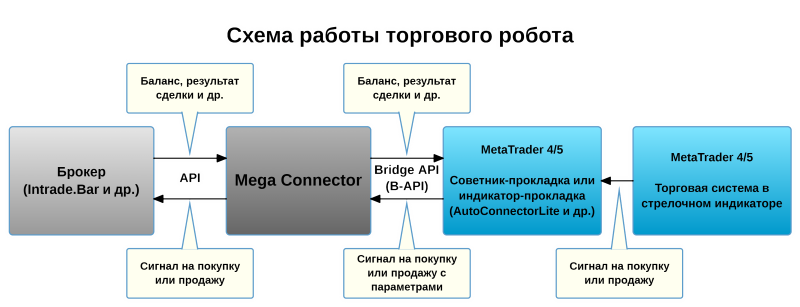
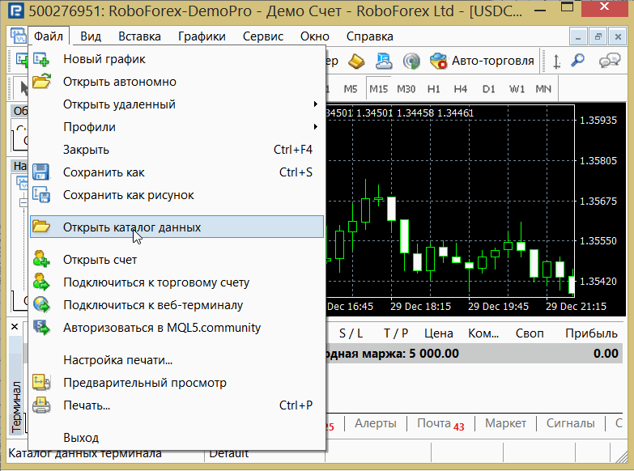
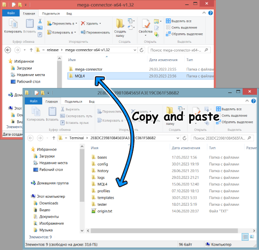
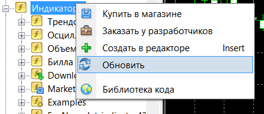
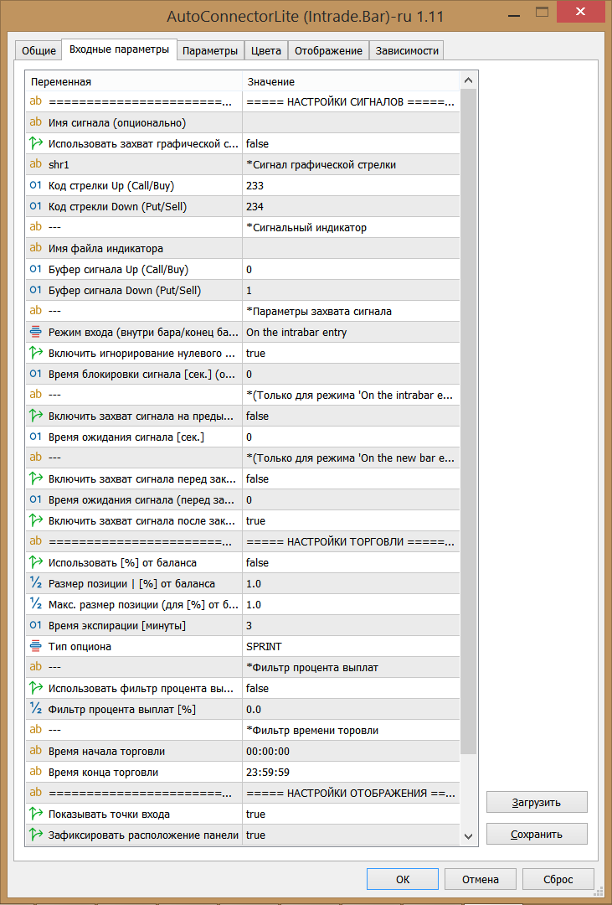
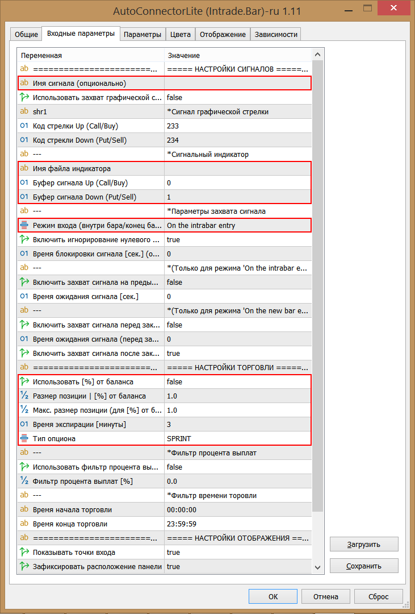
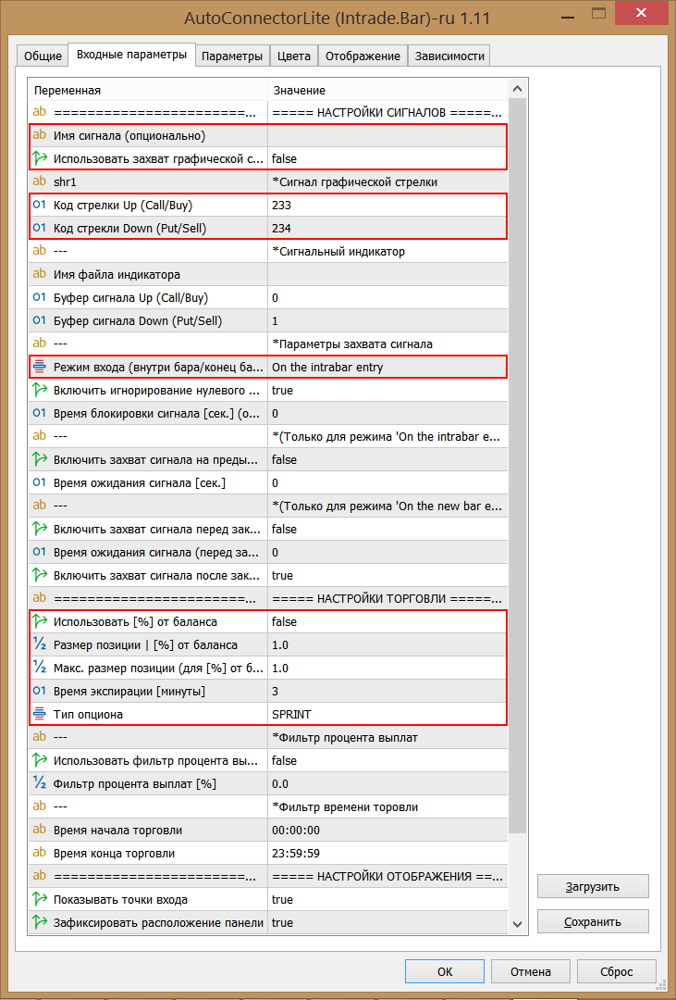
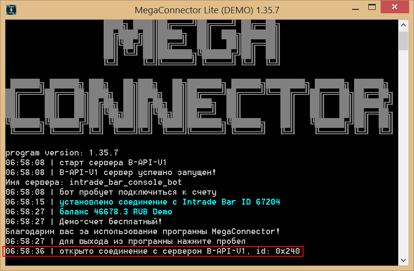

# Руководство по подключению сигнального индикатора к программе MegaConnector

Взаимодействие между торговым роботом и сигнальным индикатором в *MetaTrader* осуществляется через индикатор-прокладку **AutoConnectorLite (Intrade.Bar)**.
Сигнальный индикатор может использовать как буферы, так и графические стрелки для отображения торговых сигналов.

## Схема работы MegaConnector

На риснуке представлена схема взаимодействия между брокером, торговым роботом, индикатором-прокладкой и сигнальным индикатором.

## Особенности захвата сигналов

* Если выбран режим захвата графической стрелки, то индикатор-прокладка сможет захватывать несколько сигналов на одном баре, что невозможно в режиме захвата буферных сигналов.

* Для режима захвата сигналов через буфер ставить сигнальный индикатор на график не обязательно. Для режима захвата графической стрелки ставить сигнальный индикатор на график - **обязательно**.

* Если нужно блокировать захват новых графических стрелок на одном и том же баре, используйте параметр **"Время блокировки сигнала [сек.] (опционально)"**.

* Некоторые сигнальные индикаторы реализованы не совсем корректно, поэтому вам могут пригодиться дополнительные параметры индикатора-прокладки. К примеру, если сигнальный индикатор может дать сигнал как внутри бара, так и после закрытия бара, то вы можете включить проверку сигнала на предыдущем баре в течении заданного времени.

## Пошаговая настройка индикатора-прокладки AutoConnectorLite

1. Запустите терминал MetaTrader и откройте каталог терминала. Для этого зайдите в меню "Файл" и нажмите "Открыть каталог данных".
	

2. Скопируйте папку *MQL5* для *MetaTrader 5* или *MQL4* для *MetaTrader 4* со всем содержимым из архива с программой MegaConnector либо данного репозитория в папку каталога данных вашего терминала *MetaTrader*.
	

3. Откройте график нужного инструмента.

4. Перейдите на вкладку "Индикаторы" в окне "Навигатор". Кликните правой кнопкой мыши на вкладке 'Индикаторы' и затем нажмите "Обновить".
	

5. Найдите во вкладке "Индикаторы" вкладку "MegaConnector". В данной вкладке находятся все вспомогательные инструменты проекта *MegaConneсtor*.

6. Для автоматизации торговли по стрелочному индикатору нужно выбрать индикатор **MegaConnector\v1\AutoConnectorLite (Intrade.Bar)** и перетащить его на график валютной пары, на которой будет работать стрелочный индикатор. Индикатор **AutoConnectorLite** является индикатором-прокладкой между вашим стрелочным индикатором и программой *MegaConnector*. Индикатор "AutoConnectorLite (Intrade.Bar)" отслеживает буферы или графические стрелки сигнального индикатора и передает их в торгового бота.

7. Настройте параметры индикатора. Окно с параметрами будет открыто автоматически после перетаскивания индикатора на график.
	
	
8. Для быстрого старта в большинстве случаев понадобится настроить лишь часть параметров. Если нужна торговля с буферным сигнальным индикатором, то должно быть достаточно настроить следующие параметры:
	
	**Буферный сигнальный индикатор не обязательно размещать на графике**, так как он вызывается автоматически самим индикатором-прокладкой через [iCustom](https://www.mql5.com/ru/docs/indicators/icustom).

	Если нужна торговля с графическими стрелками, то нужно настроить следующие параметры:
	
	
	8.1. (Опционально) Введите имя сигнала в поле "Имя сигнала (Опционально)", чтобы было удобнее анализировать статистику.
	
	8.2. Укажите режим захвата сигналов, который вам необходим, через параметр **Использовать захват графической стрекли**.
	
	8.3. Если был выбран режим захвата сигнала из буфера, укажите параметры **Имя файла индикатора**, **Буфер сигнала Up (Call/Buy)** и **Буфер сигнала Down (Put/Sell)**.
	
	8.4. Если был выбран режим захвата графической стрекли, укажите параметры **Код стрелки Up (Call/Buy)** и **Код стрекли Down (Put/Sell)**.
	
	8.5. Если нужен расчет размера сделки от баланса в процентах, укажите **true** в параметре **Использовать [%] от баланса**. Укажите размер позиции в процентах в параметре **Размер позиции | [%] от баланса**. Укажите максимальный размер позиции в валюте счета в параметре **Макс. размер позиции (для [%] от баланса)**
	
	8.6. Если нужен фиксированный размер позиции, укажите **false** в параметре **Использовать [%] от баланса**. Пропишите размер позиции в валюте депозита в параметре **Размер позиции | [%] от баланса**.
	
	8.7. Укажите время экспирации в параметре **Время экспирации [минуты]** и тип опциона в параметре **Тип опциона**.
	
	8.8. Индикатор-прокладка гоотов к работе. Остальные параметры являются не обязательными, но могут быть полезны или даже необходимы для работы именно вашего индикатора. Изучите остальные настройки индикатора-прокладки в данной синтрукции.
	
9. Если торговый бот MegaConnector еще не работает, запустите его. После подключения к счету он отобразит состояние подключения к AutoConnectorLite.
	
	
## Описание настроек индикатора-прокладки AutoConnectorLite
	
1. **Имя сигнала (Опционально)** - укажите имя сигнала, которое будет отражаться в таблице статистики торговли. Можно не указывать.
	
2. **Использовать захват графической стрекли** - если необходимо захватывать графическую стрелку сигнального индикатора, укажите **true**. Если нужно захватывать сигналы из буферов сигнального индикатора, укажите **false**.
	
3. Если был выбран режим захвата графической стрекли, укажите следующие параметры:
	
	3.1. **Код стрелки Up (Call/Buy)** - Код графической стрелки для сигнала на покупку.
		
	3.2. **Код стрекли Down (Put/Sell)** - Код графической стрелки для сигнала на продажу.
		
	3.3. **Режим входа (внутри бара/конец бара)** - Выберите режим *On the intrabar entry* для входа внутри бара либо *On the new bar entry* для входа на с появлением нового бара или перед закрытием бара.

	3.4. **Время блокировки сигнала [сек.]** - Время блокировки захвата новых сигналов. Если указать значение выше нуля, то индикатор-прокладка захватит сигнал графической стрелки только если новая стрелка появился после истечения времени блокировки. Блокировка захвата сигнала возникает после каждого нового сигнала, который был обработан.
		
	3.5. **Включить захват сигнала на предыдущем баре** - Если указать **true**, то в режиме *On the intrabar entry* будет осуществляться проверка сигнала не только внутри текущего бара, но таже и на предыдущем баре в течении заданного времени. Следующий параметр настаривает время проверки.
		
	3.6. **Время ожидания сигнала [сек.]** - Время ожидания сигнала на предыдущем баре в режиме *On the intrabar entry*. Отсчет времени ведется с момента начала нового бара.
		
	3.7. **Включить захват сигнала перед закрытием бара** - Если указать **true**, то в режиме *On the new bar entry* будет осуществляться захват сигнала на текущем баре перед закрытием бара в течении заданного времени. Время задается следующим параметром.
		
	3.8. **Время ожидания сигнала (перед закрытием бара) [сек.]** - Время, в течении которого будет осуществляться захват сигнала на текущем баре перед закрытием бара. К примеру, если указать 10 сек., то проверка сигнала начнется за 10 секунд до закрытия бара и закончится в момент закрытия.
		
	3.9. **Включить захват сигнала после закрытия бара** - Если указать **true**, то в режиме *On the new bar entry* будет осуществляться захват сигнала после появления нового бара. При этом сигнал будет захватываться с предыдущего бара.
		
4. Если был выбран режим захвата буферного сигнала, укажите следующие параметры:
	
	4.1. **Имя файла индикатора** - Имя сигнального индикатора.
	
	4.2. **Буфер сигнала Up (Call/Buy)** - Номер буфера сигнального индикатора для сигналов на покупку.
		
	4.3. **Буфер сигнала Down (Put/Sell)** - Номер буфера сигнального индикатора для сигналов на продажу.
		
	4.4. **Режим входа (внутри бара/конец бара)** - Выберите режим *On the intrabar entry* для входа внутри бара либо *On the new bar entry* для входа на с появлением нового бара или перед закрытием бара.

	4.5. **Включить игнорирование нулевого сигнала** - Флаг включает пропуск сигналов, для которых в буфере установлено значение, равное нулю. Рекомендовано установить данный параметр, если сигнальный индикатор не использует нулевые значения.
		
	4.6. **Время блокировки сигнала [сек.]** - Время блокировки захвата новых сигналов. Если указать значение выше нуля, то индикатор-прокладка захватит сигнал из буфера только после истечения времени блокировки. Блокировка захвата сигнала возникает после каждого нового сигнала, который был обработан. Так как на каждый бар может быть только один сигнал, то блокировка имеет смысл лишь когда нужно пропускать сигналы на следующих барах. К примеру, если нужно пропускать сигналы в течении 5 минут и торговля идет на М1, то стоит указать время блокировки 300 секунд. Если же торговля идет на М5, то время блокировки на 5 минут уже не имеет смысла указывать, так как на одном баре М5 может быть только один сигнал. 
		
	4.7. **Включить захват сигнала на предыдущем баре** - Если указать **true**, то в режиме *On the intrabar entry* будет осуществляться проверка сигнала не только внутри текущего бара, но таже и на предыдущем баре в течении заданного времени. Следующий параметр настаривает время проверки.
		
	4.8. **Время ожидания сигнала [сек.]** - Время ожидания сигнала на предыдущем баре в режиме *On the intrabar entry*. Отсчет времени ведется с момента начала нового бара.
		
	4.9. **Включить захват сигнала перед закрытием бара** - Если указать **true**, то в режиме *On the new bar entry* будет осуществляться захват сигнала на текущем баре перед закрытием бара в течении заданного времени. Время задается следующим параметром.
		
	4.10. **Время ожидания сигнала (перед закрытием бара) [сек.]** - Время, в течении которого будет осуществляться захват сигнала на текущем баре перед закрытием бара. К примеру, если указать 10 секунд, то проверка сигнала начнется за 10 секунд до закрытия бара и закончится в момент закрытия.
		
	4.11. **Включить захват сигнала после закрытия бара** - Если указать **true**, то в режиме *On the new bar entry* будет осуществляться захват сигнала после появления нового бара. При этом сигнал будет захватываться с предыдущего бара.
		
5. **Использовать [%] от баланса** - Если нужно торговать заданным процентом от текущего баланса, укажите **true**. Если нужен обычный фиксированный размер сделки в валюте депозита, то укажите **false**.
	
	5.1. **Размер позиции | [%] от баланса** - В зависимости от того, был выбран процент от текущего баланса или фиксированный размер сделки, укажите либо процент от баланса либо размер позиций в валюте депозита.
	
	5.2. **Макс. размер позиции (для [%] от баланса)** - Укажите максимально возможный размер сделки в валюте депозита для торговли процентом от текущего баланса. Данная переменная нуна для перестраховки и ограничивает размер сделок.

	5.3. **Время экспирации [минуты]** - Время экспирации сделок в минутах. Опционы имеют продолжительность от 3 до 500 минут. Для CLASSIC опционов экспирация должна быть кратна 5-ти минутам.
	
	5.4. **Тип опциона** - Тип опциона. SPRINT опцион имеет заданную продолжительность. CLASSIC опцион имеет фиксированную дату закрытия, которая не зависит от времени открытия.
	
	5.5. **Использовать фильтр процента выплат** - Флаг, который включает фильтр процента выплат, если указать **true**.
	
	5.6. **Фильтр процента выплат [%]** - Минимальный процент выплат, при котором сделка еще будет открыта. Если процент выплат упадет ниже заданного значения, то сигнал будет пропущен.
	
	5.7. **Время начала торговли** - Время, начиная с которого торговля разрешена. Часовой пояс как у MetaTrader.
	
	5.8. **Время конца торговли** - Время, после которого торговля остановлена. Часовой пояс как у MetaTrader.
	
	5.9. **Показывать точки входа** - Флаг, включает отображение точек входа на графике.
	
	5.10. **Зафиксировать расположение панели** - Флаг, включает привязку панели к углу графика.
	
	5.11. **Позиция панели на графике** - Угол привязки панели к графику. Данный параметр работает, только если включена фиксация положения (7.15).
	
	5.12. **Время обновления советника [мс.]** - Данный параметр настраивает частоту опроса API для связи индикатора-прокладки с программой торгового бота.
	
	5.13. **Имя именнованного канала** - Имя именнованного канала API. Может пригодиться, если на одном компьютере запускать несколько разных ботов.
	
	